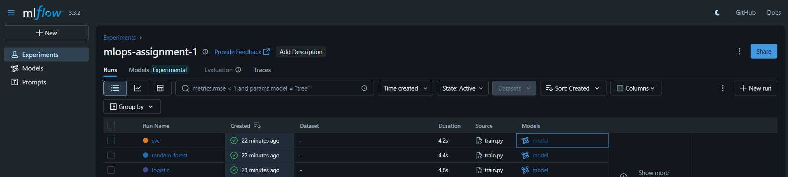
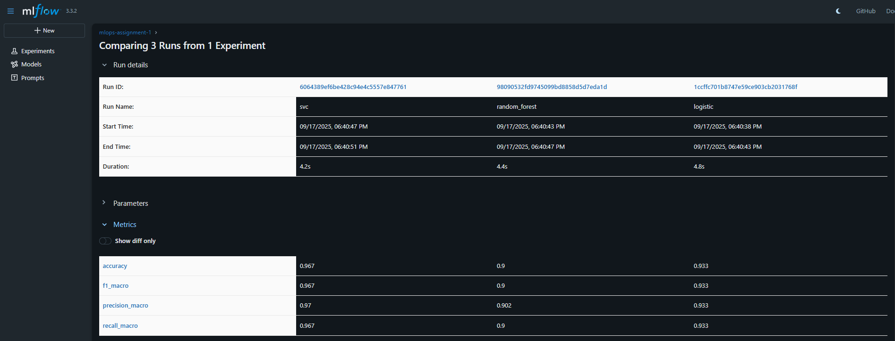
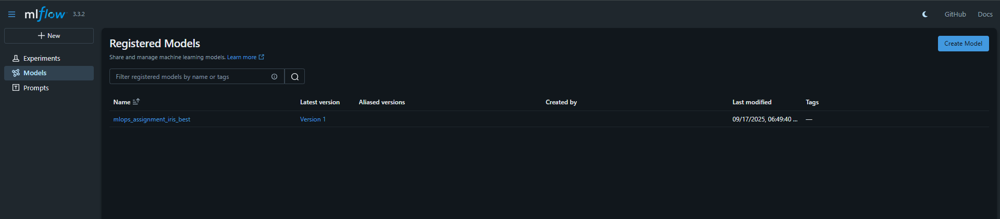

# MLOps Assignment 1: Github Setup, Model Training & Comparison, MLflow Tracking & Logging, Monitoring & Model Registration, and Documentation

##  Objective
The purpose of this assignment is to gain hands-on experience with:
1. Using GitHub for version control and collaboration.
2. Building and training ML models for comparison.
3. Using MLflow for experiment tracking, logging, monitoring, and model registration.
4. Structuring the workflow so that all code and results are reproducible.

By the end of this project:
- Multiple ML models were trained and compared.
- MLflow logs contain metrics, parameters, and artifacts.
- The best model was registered in the MLflow Model Registry.
- A GitHub repository contains the full project code and documentation.

---

##  Problem Statement & Dataset
The dataset chosen for this assignment is the **Iris dataset** (a classic multiclass classification dataset).  
- **Task:** Predict the species of an iris flower (Setosa, Versicolor, Virginica) based on its features (sepal length, sepal width, petal length, petal width).  
- **Type:** Multiclass classification (3 classes).  

---
##  Business Goals Achieved

This repository demonstrates how MLOps practices can be applied to machine learning projects in a business setting:

1. **Reproducibility** – Ensures all experiments can be rerun with the same results, reducing risks in production.
2. **Model Comparison** – Provides objective evaluation of multiple models, helping businesses select the best solution.
3. **Experiment Tracking** – MLflow logs make it easy to monitor progress, compare performance, and maintain transparency.
4. **Model Registry** – Establishes a version-controlled hub for production-ready models, enabling smoother deployment.
5. **Collaboration** – GitHub integration supports version control and teamwork across data science and engineering teams.

By following these steps, organizations can save time, reduce errors, and streamline the path from research to deployment.

---

##  Model Selection & Comparison
Three machine learning models were trained and compared:

| Model                | Accuracy | Precision | Recall | F1-score |
|-----------------------|----------|-----------|--------|----------|
| Logistic Regression   | 0.933     | 0.933      | 0.933   | 0.933     |
| Random Forest         | 0.9     | 0.902      | 0.9   | 0.9     |
| Support Vector Machine| 0.967     | 0.97      | 0.967   | 0.967     |

 The **Support Vector Machine** performed the best with the highest accuracy and F1-score.

---

##  MLflow Tracking
MLflow was used to track experiments:
- **Parameters:** hyperparameters such as `n_estimators`, `kernel`, etc.
- **Metrics:** accuracy, precision, recall, F1-score.
- **Artifacts:** saved models, plots, and confusion matrices.

### Example MLflow Run Screenshot


### Metrics Comparison Screenshot


---

##  Model Registration
The best performing model (**Support Vector Machine**) was registered in the **MLflow Model Registry** with the name:

```
mlops_assignment_iris_best
```

- Version: **1**
- Description: Support Vector Machine trained on the Iris dataset.

### Model Registry Screenshot


---

##  Instructions to Reproduce

### 1. Clone the Repository
```cmd
git clone https://github.com/<your-username>/mlops-assignment-1.git
cd mlops-assignment-1
```

### 2. Install Dependencies
```cmd
pip install -r requirements.txt
```

### 3. Run MLflow UI
```cmd
mlflow ui
```
Then open [http://127.0.0.1:5000](http://127.0.0.1:5000) in your browser.

### 4. Train Models
```cmd
python src/train.py
```

### 5. View Results
- Check MLflow UI for logged parameters, metrics, and artifacts.
- View registered model under **Models tab** in MLflow.

---

##  Project Structure
```
mlops-assignment-1/
├── data/                  # Dataset folder
├── notebooks/             # Jupyter notebooks for exploration
├── src/                   # Source code (training, utils)
│   └── train.py
├── models/                # Saved models
├── results/               # Results, plots, screenshots
│   ├── mlflow_runs.png
│   ├── mlflow_metrics.png
│   └── mlflow_registry.png
├── requirements.txt       # Dependencies
└── README.md              # Documentation
```

---

##  Deliverables
- Public GitHub repository with code and documentation.
- README with:
  - Problem statement & dataset description.
  - Model selection & comparison table.
  - MLflow logging screenshots.
  - Model registry screenshot.
  - Reproducibility instructions.

---

##  Evaluation Mapping
- GitHub Setup & Workflow: **20%**
- Model Training & Comparison: **25%**
- MLflow Tracking & Logging: **30%**
- Monitoring & Registration: **15%**
- Documentation & Submission: **10%**

---

##  Acknowledgements
- Dataset: UCI Machine Learning Repository (Iris Dataset)
- Libraries: scikit-learn, pandas, numpy, matplotlib, mlflow
